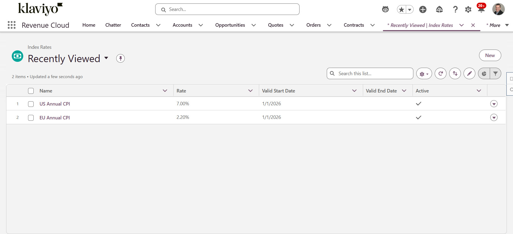
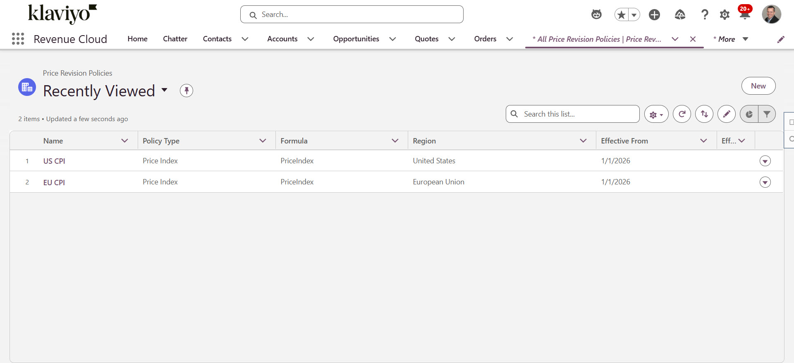
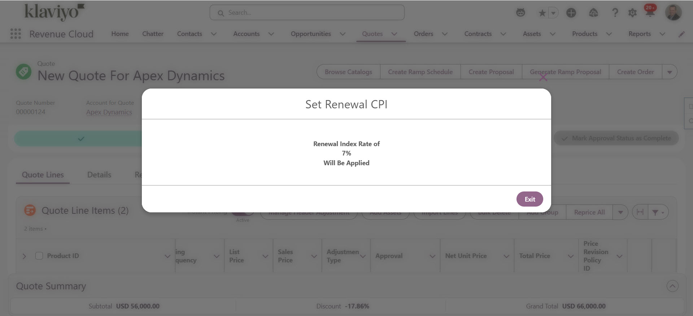
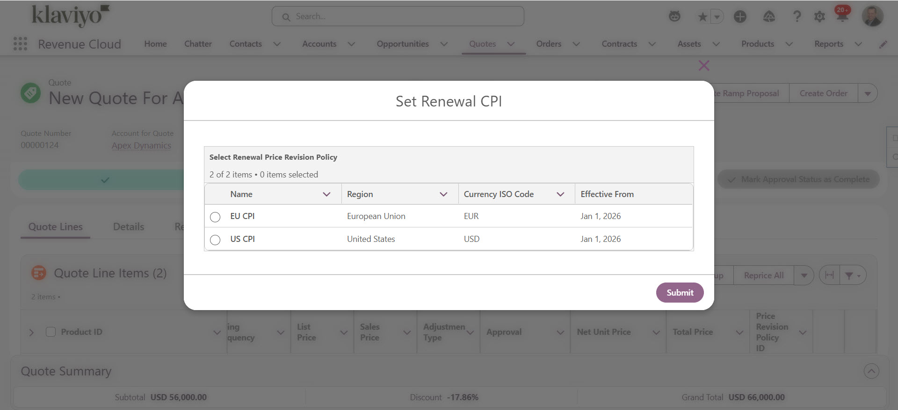

# Set Renewal Uplift (CPI Price Index) to All Quote Lines

Automation to apply a Price Revision Policy record to all quote line items at once.

## Prerequisites

- QuantumBit Org with Price Revision element configured in Pricing Procedure
- Index Rates table has records for lookup
- Price Revision Policies are configured

### Prerequisite: Index Rates Table

### Prerequisite: Price Revision Policies

## Flow

